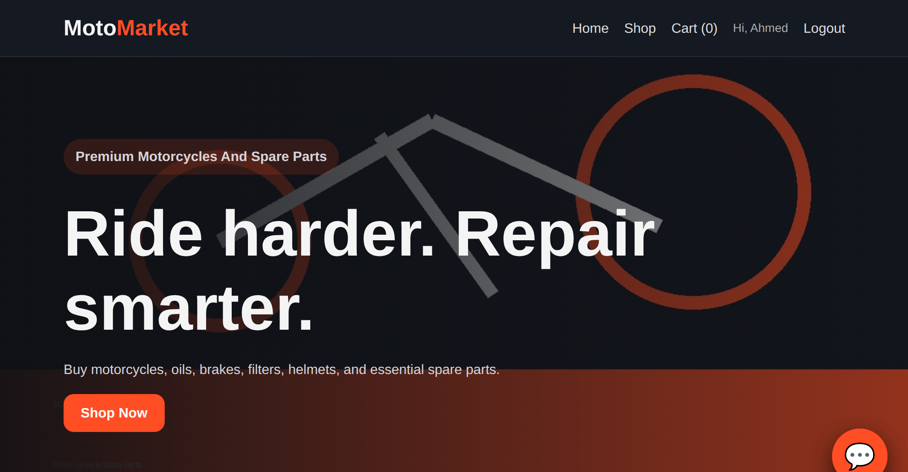
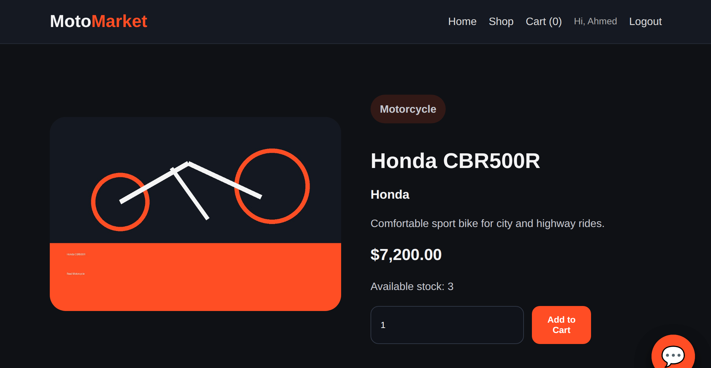
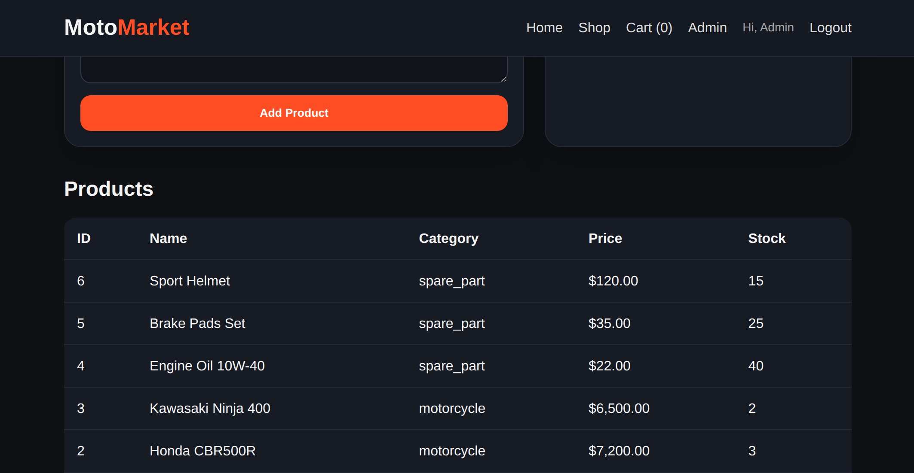
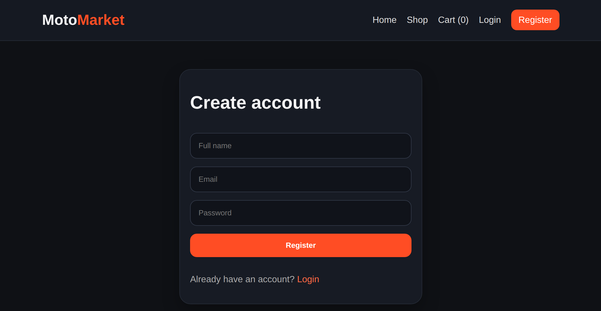
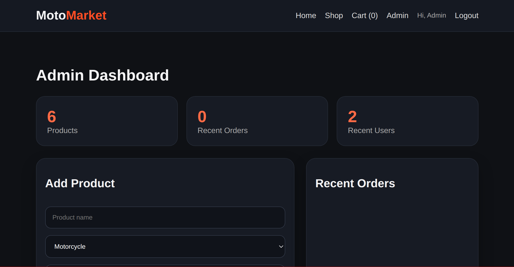
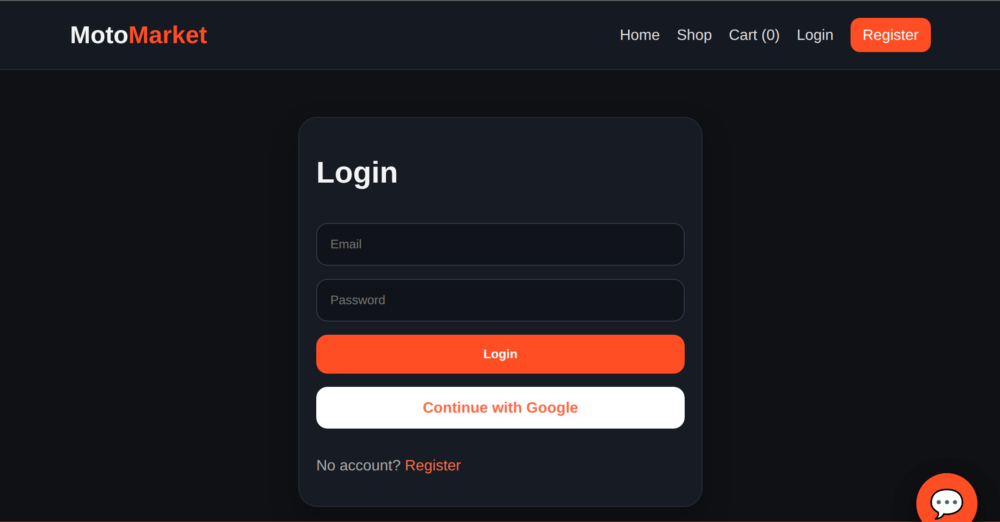
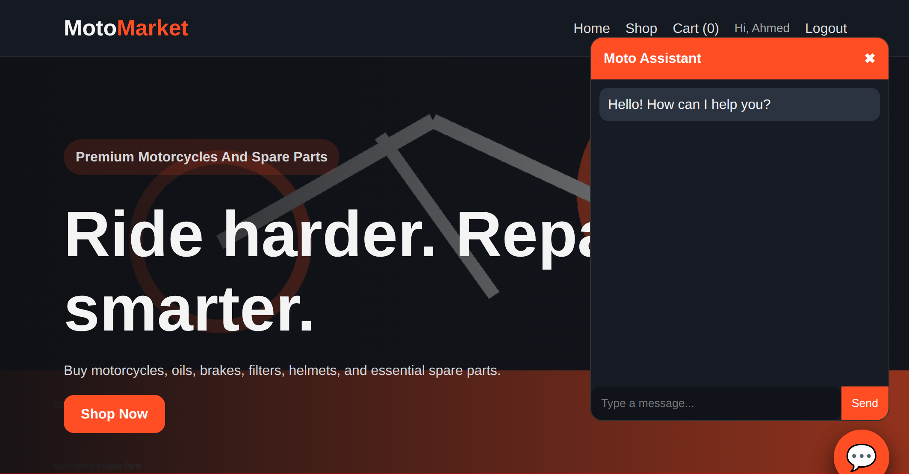

# 🏍️ MotoMarket

A full-stack e-commerce platform for motorcycles and spare parts, designed to provide a seamless shopping experience for motorcycle enthusiasts. MotoMarket allows customers to browse products, manage carts, place orders, and interact with an AI-powered assistant, while administrators can manage inventory and monitor platform activity.

---

## ✨ Features

### Customer Features
- User Registration & Authentication
- Secure Login System
- Browse Motorcycles & Spare Parts
- Product Search & Filtering
- Shopping Cart Management
- Product Details Page
- Order Placement
- Responsive Modern UI
- AI-Powered Moto Assistant Chatbot

### Admin Features
- Admin Dashboard
- Product Management
- Inventory Tracking
- User Monitoring
- Order Management
- Real-Time Statistics Overview

---

## 📸 Screenshots

### Home Page


### Product Details


### Login


### Register


### Admin Dashboard


### Product Management


### Moto Assistant Chatbot


## 🛠️ Tech Stack

### Frontend
- React.js
- JavaScript (ES6+)
- CSS3
- Responsive Design

### Backend
- Node.js
- Express.js

### Database
- PostgreSQL

### Authentication
- JWT Authentication
- Google OAuth

### Additional Services
- AI Chat Assistant Integration

---

## 🚀 Installation

### Clone the Repository

```bash
git clone git@github.com:Ahmed-Gonga/MotoMarket.git
cd MotoMarket
```

### Install Dependencies

Frontend:

```bash
cd frontend
npm install
```

Backend:

```bash
cd backend
npm install
```

### Configure Environment Variables

Create a `.env` file in the backend directory:

```env
DATABASE_URL=your_database_url
JWT_SECRET=your_secret_key
GOOGLE_CLIENT_ID=your_google_client_id
GOOGLE_CLIENT_SECRET=your_google_client_secret
```

### Start Development Servers

Backend:

```bash
npm run dev
```

Frontend:

```bash
npm start
```

---

## 📂 Project Structure

```text
MotoMarket/
│
├── frontend/
│   ├── src/
│   ├── public/
│   └── components/
│
├── backend/
│   ├── controllers/
│   ├── routes/
│   ├── middleware/
│   ├── models/
│   └── services/
│
├── database/
│
├── screenshots/
│
└── README.md
```

---

## 🎯 Key Functionalities

- Motorcycle marketplace system
- Spare parts catalog management
- Shopping cart functionality
- User authentication & authorization
- Google Sign-In integration
- Admin control panel
- Inventory management
- AI-powered customer support assistant

---

## 🔒 Security

- Password Hashing
- JWT-Based Authentication
- Protected Admin Routes
- Input Validation
- Secure API Communication

---

## 👨‍💻 Author

**Ahmed Wahba**

GitHub: https://github.com/Ahmed-Gonga

---

## 📄 License

This project is intended for educational and portfolio purposes.
